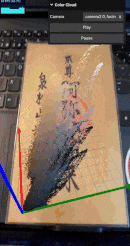
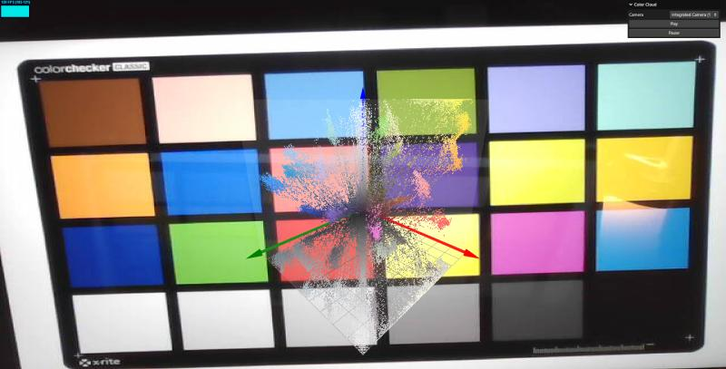
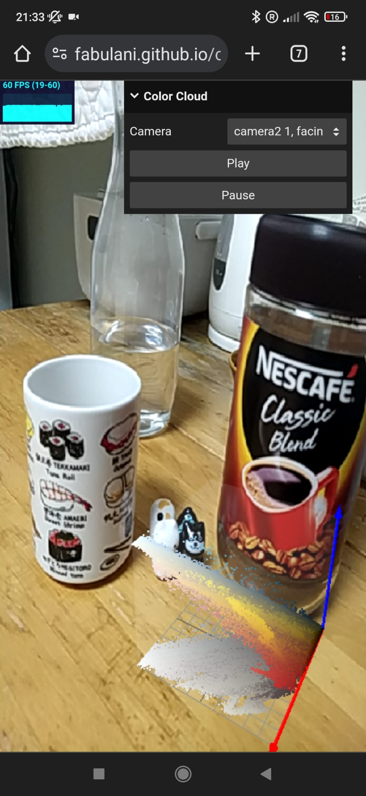

# Color Visualizer

 

A web application dedicated to real-time color visualization.

When the app has access to a video stream (e.g., webcam or smartphone camera), it’ll convert the video RGB information into a point cloud rendered on the screen in real-time. This is achieved by use of Three.js and shaders programmed in **OpenGL Shading Language** **(GLSL).**

_Note_: point cloud shadow can be grayscale or black. Latest version uses black.

[Try it live here!](https://fabulani.github.io/color_visualizer/)

